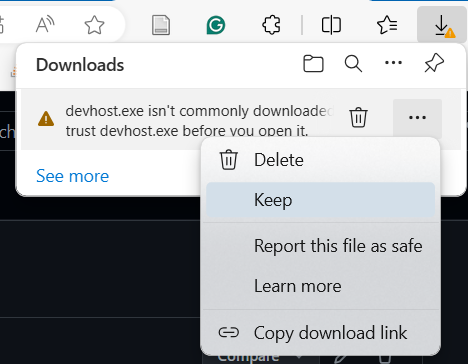
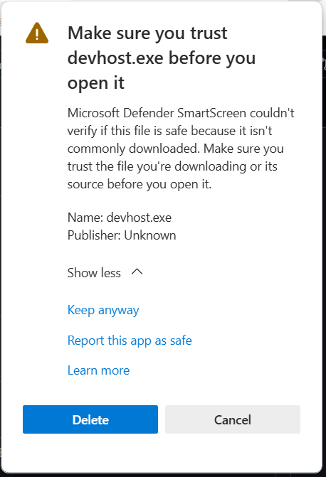
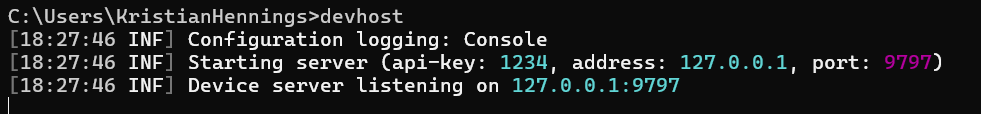

# LabBench DeviceHost, Beta
The LabBench DeviceHost provides a socket based interface that allow LabBench devices such as the LabBench CPAR+ device to be used from 3rd party software such as Presention(R) from [Neuro Behavioral Systems](https://www.neurobs.com/menu_presentation/menu_features/features_overview), E-Prime from [Psychology Software Tools](https://pstnet.com/products/e-prime/) or [PsychoPy](https://www.psychopy.org/).

LabBench devices is controlled by a binary serial communication protocol [Embedded Communication Protocol (ECP)](https://github.com/Inventors-Way/Inventors.ECP). This protocol is open with an open source implementation. However, as it is a relatively complex binary protocol it is challenging to implement it directly in software such as Presentation(R) or E-Prime. To alleviate this the LabBench DeviceHost acts as a bridge between the Embedded Communication Protocol (ECP) and 3rd party software. 

Using the LabBench Device Host consists of sending text commands in the form of:

```
START;
USE PORT COM8 CPARPLUS;
CMD PING;
END;
```

To a socket whos IP address and port number if configured when starting the LabBench Device Host. If a CPAR+ device is found on COM8 the Device Host will respond with:

```
START;
DEVICE CPAR+;
VERSION 1.0.1;
END;
```

In general commands will respond with either ```OK;```, ```ERR;[Error Code]```, or ```[Data from the device]```. For example, if no device was connected to COM8 the command will instead respond with:

```
START
ERR DeviceClosed;
END
```

For a full list of possible error codes, please see section Error Codes

## Installation

The LabBench Device Host is a single self-contained executable file (devhost.exe) that can be downloaded from the [Releases](https://github.com/Inventors-Way/LabBench.DeviceHost/releases) of this repository. Download it to a folder on your computer and place this folder on the path.

One complication is that as it is an executable file your computer might mark this file as potentially unsafe and not allow you to download it. How to solve it is illustrated for Explorer, however, all browsers have similar mechanisms.

For Explorer this will look like:



which will result in the following dialog:



In which you must choose Keep Anyway in order to successfully download the LabBench Device Host. In the future, once the LabBench Device Host is out of Beta, we plan to create a signed installer that bypasses this problem.

## Starting the device host

The device host can be started with its default configuration by calling the ```devhost``` command without any parameters:



The text displayed by the Device Host is its log output. If your 3rd party software does not work as intended it can be helpful to check this log for error messages as these are more detailed than the error codes returned by the Device Host over the socket interface.

The Device Host can be configured with the following command line parameters:

|Parameter          | Description|
|-------------------|-----------|
|```-a --address``` | The address on which to host the device host (default: 127.0.0.1 / localhost) |
|```-p --port```    | The port on which to bind the device host (default: 9797) |
|```-l --log-file```| Log File to which to write the log, if left out the log will only be written to console. |

Help for these can also be shown by calling the devhost with a ```--help``` parameter.


## Using the DeviceHost from 3rd party software

### General format for data set to and from the Device Host

All commands and response to commands are sent in the form of packets that are started and ended with START and END statements, respectively:

```
START;
{PACKET CONTENT}
END;
```

### General format for commands

The general format for all commands is shown below:

```
USE [SYSTEM] {PORT} {DEVICE};
CMD [COMMAND];
{COMMAND STATEMENTS}
```

This format consists of a list of statements each terminated by a semicoloon ```;```. The ```[]``` notation means a part that is mandatory and must be specified for all commands, and the ```{}``` specifies a part that is only mandatory for certain types of systems or commands.

#### USE Statement

Following the START Statement all commands must be followed by a USE statement in the following format:

```
USE [SYSTEM] {PORT} {DEVICE};
```

The ```SYSTEM``` parameter specifies which system to use. Possible values:

1. **SERVER**: Internal functionality for listing ports, creating and deleting device handlers.
2. **PORT**: Functionality to communicate with LabBench devices.

The ```PORT``` parameter is required for the PORT system, and specifies which port to access (i.e. COM4).

The ```DEVICE``` parameter specifies which device the host should expect to find on the port. Possible values:

1. **CPARPLUS**: The LabBench CPAR+ device.

#### CMD Statement

The command statement tells the DeviceHost which command to execute by the system that was selected in the USE statement.

```
CMD [COMMAND];
{COMMAND STATEMENTS}
```

For the set of possible commands, please see the description of the SYSTEM and CPARPLUS systems.

### Connecting to the device host

To connect to the DeviceHost, open an http socket with UTF8 encoding to address and port configured when the DeviceHost was started. If no parameters are specified this will be ```127.0.0.1:9797```.

### Procedure for accessing a device.

To use a LabBench Device:

1. Create a handler for device on its COM port (USE SYSTEM + CMD CREATE).
2. Open the COM port (USE CPARPLUS + CMD OPEN).
3. Start sending commands (USE CPARPLUS + selected commands)
4. Close the COM port (USE CPARPLUS + CMD CLOSE)
5. Delete the handler (USE SYSTEM + CMD DELETE)

If the DeviceHost is closed from the command line, then step 4 + 5 is optional, and will be executed automatically when the program is closed. To close the program from the command line, press CTRL + C.

## Server Commands

#### PORTS

List the COM ports:

```
USE SERVER;
CMD PORTS;
```

**Response:** This command will return a a list of COM ports in the form of:

```
PORT {Port Name 1}
PORT {Port Name 2}
...
PORT {Port Name N}
```

#### CREATE

Create a device handler on a given ```[PORT]``` port and ```[DEVICETYPE]``` device type:

```
USE SERVER;
CMD CREATE;
PORT [PORT]; 
DEVICE [DEVICETYPE];
```

**Response:** ```OK;``` if successfull, otherwise ```ERR;[ERRORCODE]```.

Parameters:
```[PORT]```: Name of the COM port. Valid values can be obtained with the SYSTEM + PORT command
```[DEVICETYPE]```: Possible values CPARPLUS

#### DELETE

Delete a device handler on a given ```[PORT]``` port:

```
USE SERVER;
CMD DELETE;
PORT [PORT];
```

**Response:** ```OK;``` if successfull, otherwise ```ERR;[ERRORCODE]```.

## Devices 

### LabBench CPAR+ Device Commands

#### OPEN

Open the COM port to allow commands to be send to a device:

```
USE PORT [PORT] CPARPLUS;
CMD OPEN;
```

**Response:** ```OK;``` if successfull, otherwise ```ERR;[ERRORCODE]```.

#### CLOSE

Close the COM port:

```
USE PORT [PORT] CPARPLUS;
CMD CLOSE;
```

**Response:** ```OK;``` if successfull, otherwise ```ERR;[ERRORCODE]```.

#### MODE

Set the operating mode of the device (1: VAS Meter enabled, 0: VAS Meter disabled):

```
USE PORT [PORT] CPARPLUS;
CMD MODE;
RESPONSE {Enabled}
```

Where {Enabled} determines whether the VAS meter is enabled or not.

**Response::** **Response:** ```OK;[DEVICETYPE]``` if successfull, otherwise ```ERR;[ERRORCODE]```.

#### PING

Will ping a device and check that it has the correct type as expected by the created handler:

```
USE PORT [PORT] CPARPLUS;
CMD PING;
```

Please, note if the port is not openend it will result in an error.

**Response::** **Response:** ```OK;[DEVICETYPE]``` if successfull, otherwise ```ERR;[ERRORCODE]```.

#### WAVEFORM

The CPARPLUS device can have up to two waveform channels that each can be routed to one or both of the two pressure outlets of the device. These programs consists of a series of instructions STEP, INC, and DEC that changes the current output pressure. To prevent errors such as infinite loops there are no brancing instructions. However, it is possible to repeat a program set number of times.

```
USE PORT [PORT] CPARPLUS;
CMD WAVEFORM;
CHANNEL [CHANNEL];
REPEAT [REPEAT];
INSTRUCTIONS [INSTRUCTIONS];
STEP [PRESSURE] [DURATION];
INC [DELTAPRESSURE] [DURATION];
DEC [DELTAPRESSURE] [DURATION];
```

**Parameters**:

* ```[CHANNEL]```: Channel for which to set the program (valid values: 0 for Channel 1 or 1: for Channel 2)
* ```[REPEAT]```: Number of times to repeat the program
* ```[INSTRUCTIONS]```: Number of subsequent instructions, must be equal to the number of instructions after the INSTRUCTIONS statement.
* ```[PRESSURE]```: Pressure to set for the STEP command, is the pressure in kPa multiplied by 10. E.g. 500 is equal to 50kPa.
* ```[DURATION]```: Duration of the instruction in ms.
* ```[DELTAPRESSURE]```: Change in pressure per second multiplied by 10 for the INC and DEC instructions. Must be a positive value. The change in pressure is relative to the current pressure CURRENTPRESSURE, and the final pressure will be ```[DELTAPRESSURE]*[DURATION] + CURRENTPRESSURE``` for the INC instruction and ```-[DELTAPRESSURE]*[DURATION] + CURRENTPRESSURE``` for the DEC instruction.

**Response:** ```OK;``` if successfull, otherwise ```ERR;[ERRORCODE]```.

#### CLEAR

Will clear all waveform programs:

```
USE PORT [PORT] CPARPLUS;
CMD CLEAR;
```

**Response:** ```OK;``` if successfull, otherwise ```ERR;[ERRORCODE]```.


#### START

Will start a pressure stimulation with the currently set pressure WAVEFORM programs:

```
USE PORT [PORT] CPARPLUS;
CMD START;
STOPCRITERION [STOPCRITERION];
EXTERNALTRIGGER [EXTERNALTRIGGER];
OVERRIDERATING [OVERRIDERATING];
OUTLET01 [WAVEFORM];
OUTLET02 [WAVEFORM];
```

**Parameters**:

* ```[STOPCRITERION]```: 0: STOP_CRITERION_ON_BUTTON_VAS the pressure stimulation will stop when VAS 10 is scored or a button is pressed, 1: STOP_CRITERION_ON_BUTTON_PRESSED the pressure stimulation will stop when a button is pressed, 2: STOP_CRITERION_ON_BUTTON_RELEASED the pressure stimulation will stop when a button is released. In all cases the stimulation will automatically stop when all pressure WAVEFORM programs have completed.
* ```[EXTERNALTRIGGER]```: If set to 0 the stimulation will start immediately, if set to 1 the stimulation will start when a trigger is received on the TRIG IN connection on the device.
* ```[OVERRIDERATING]```: If set to 0 the stimulation will not start if VAS != 0, if set to 1 the stimulation will start regardless of the current VAS rating. 
* ```[WAVEFORM]```: Which WAVEFORM program is routed to the pressure outlet. 0: None, 1: Channel 1, 2: Channel 2.

**Response:** ```OK;``` if successfull, otherwise ```ERR;[ERRORCODE]```.

#### STOP

Stops any active pressure stimulation:

```
USE PORT [PORT] CPARPLUS;
CMD STOP;
```

**Response:** ```OK;``` if successfull, otherwise ```ERR;[ERRORCODE]```.

Please note, if the intention is to stop a stimulation, no harm will come from executing this command even if a pressure stimulation is not active.

#### STATE

Return the state of the device:

```
USE PORT [PORT] CPARPLUS;
CMD STATE;
```

If successfull it will return the state of the device in the form of:

```
STATE [STATE];
RESPONSE_CONNECTED [0 or 1];
RESPONSE_LOW [0 or 1];
POWER [0 or 1];
START_POSSIBLE [0 or 1];
STOP_CONDITION [0 or 1];
FINAL_PRESSURE01 [PRESSURE];
FINAL_PRESSURE02 [PRESSURE];
SUPPLY_PRESSURE_OK [0 or 1];
SUPPLY_PRESSURE [PRESSURE];
```

**Values**:
 
* ```[STATE]```: State of the device. Possible values STATE_NOT_CONNECTED, STATE_IDLE, STATE_STATE_STIMULATING, STATE_EMERGENCY, STATE_PENDING. STATE_NOT_CONNECTED: COM port is not open. STATE_IDLE: No active pressure stimulation. STATE_EMERGENCY: Emergency button is active and pressure is vented to ambient air. STATE_PENDING: The device is active but waiting for an external trigger to start pressure stimulation.
* ```FinalPresureXX```: The final pressure for outlet XX when the pressure stimulation was completed either by fullfilment of the STOPCRITERION or when the pressure WAVEFORM programs completed. This is useful for determination of Pain Detection and Tolerance Thresholds.
* ```[PRESSURE]```: Pressure in kPa multiplied by 10.


or an error in the form of ```ERR;[ERRORCODE]```.

#### SIGNALS

Returns pressures and ratings since last execution of the SIGNALS command:

```
USE PORT [PORT] CPARPLUS;
CMD SIGNALS;
```

If successfull it will return the state of the device in the form of:

```
DATA Pressure01 Pressure02 Rating;
```

The DATA lines is repeated for as many samples that has been cached from the device. Once the data is sent the cache is emptied and it is the responsibility of the client to store the data.

Please note, if no pressures are available there the Device Host will return an empty START/END packet.

**Values**:
* ```{Pressure}```: Pressure in kPa multiplied by 10.
* ```{Rating}```: VAS rating in mm.

or an error in the form of ```ERR;[ERRORCODE]```.

#### RATING

Will return the current ratings:

```
USE PORT [PORT] CPARPLUS;
CMD RATING;
```

If successfull it will return the state of the device in the form of:

```
SCORE [0 to 100];
FINAL_SCORE [0 to 100];
BUTTON [0 or 1];
LATCHED_BUTTON [0 or 1];
```

**Values:**

* SCORE: The curreent VAS scopre in mm.
* FINAL_SCORE: The VAS score when either the STOPCRITERION was fullfilled or at the comperion of the pressure WAVEFORM programs.
* BUTTON: Current state of the button. 0: No button pressed, 1: One or more button pressed.
* LATCHED_BUTTON: Has a button been pressed since the last execution of the RATING command.

or an error in the form of ```ERR;[ERRORCODE]```.

## Error Codes

|Code|Description|
|----|-----------|
|NoHandlerFound| |
|InvalidCommandFormat| |
|InvalidStartOfCommand| |
|MissingUseStatement| |
|InvalidEndOfCommand| |
|NoCommandStatement| |
|NoApiKey| |
|InvalidNumberOfInstructions| |
|InvalidStepInstruction| |
|InvalidIncrementInstruction| |
|InvalidDecrementInstruction| |
|UnknownInstruction| |
|InvalidStartCommandContent| |
|InvalidParameterSpecification| |
|InvalidInteger| |
|UnknownCommand| |
|OpenFailed| |
|NoStatus| |
|DeviceClosed| |
|CommunicationFailure| |
|IncompatibleDevice| |
|CloseFailed| |
|InvalidCommandContent| |
|NoPortStatement| |
|NoDeviceStatement| |
|HandlerExists| |
|UnknownDevice| |
|ParketFrammingError| |
|InvalidModeCommandContent| |


